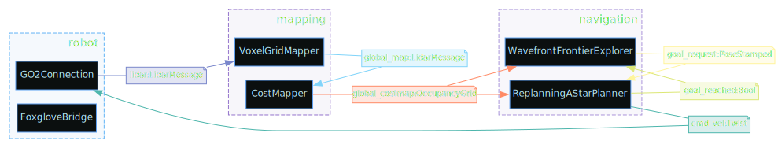
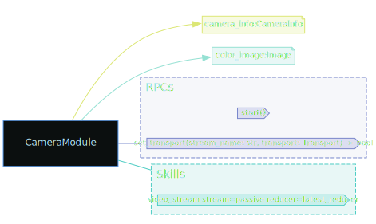
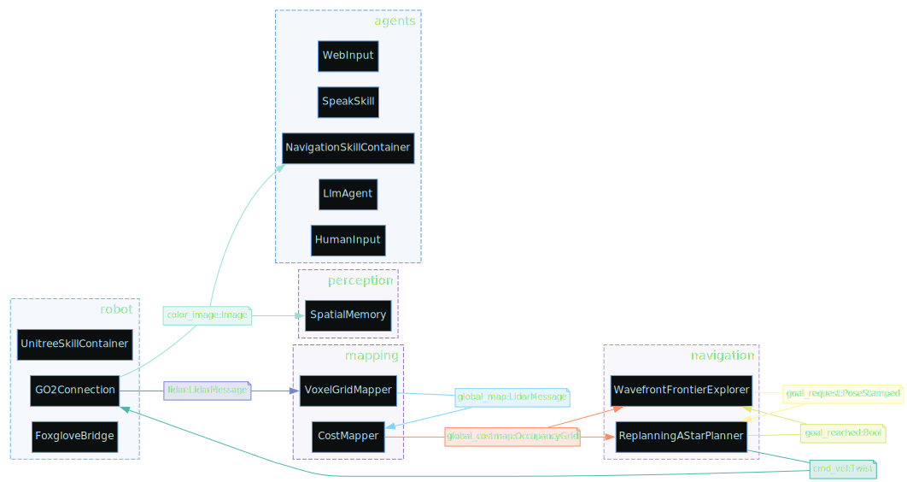

# DimOS Modules

Modules are subsystems on a robot that operate autonomously and communicate with other subsystems using standardized messages.

Some examples of modules are:

- Webcam (outputs image)
- Navigation (inputs a map and a target, outputs a path)
- Detection (takes an image and a vision model like YOLO, outputs a stream of detections)

Below is an example of a structure for controlling a robot. Black blocks represent modules, and colored lines are connections and message types. It's okay if this doesn't make sense now. It will by the end of this document.

> **Prerequisite:** Blueprint visualization (both SVG export and the Rerun Graph tab) requires Graphviz:
> ```bash
> sudo apt install graphviz   # Ubuntu/Debian
> brew install graphviz        # macOS
> ```

```python output=assets/go2_nav.svg
from dimos.core.introspection import to_svg
from dimos.robot.unitree_webrtc.unitree_go2_blueprints import nav
to_svg(nav, "assets/go2_nav.svg")
```

<!--Result:-->


## Camera Module

Let's learn how to build stuff like the above, starting with a simple camera module.

```python session=camera_module_demo output=assets/camera_module.svg
from dimos.hardware.sensors.camera.module import CameraModule
from dimos.core.introspection import to_svg
to_svg(CameraModule.module_info(), "assets/camera_module.svg")
```

<!--Result:-->


We can also print Module I/O quickly to the console via the `.io()` call. We will do this from now on.

```python session=camera_module_demo ansi=false
print(CameraModule.io())
```

<!--Result:-->
```
┌┴─────────────┐
│ CameraModule │
└┬─────────────┘
 ├─ color_image: Image
 ├─ camera_info: CameraInfo
 │
 ├─ RPC start()
 ├─ RPC stop()
 │
 ├─ Skill take_a_picture
```

We can see that the camera module outputs two streams:

- `color_image` with [sensor_msgs.Image](https://docs.ros.org/en/melodic/api/sensor_msgs/html/msg/Image.html) type
- `camera_info` with [sensor_msgs.CameraInfo](https://docs.ros.org/en/melodic/api/sensor_msgs/html/msg/CameraInfo.html) type

It offers two RPC calls: `start()` and `stop()` (lifecycle methods).

It also exposes an agentic [skill](/docs/usage/blueprints.md#defining-skills) called `take_a_picture` (more on skills in the Blueprints guide).

We can start this module and explore the output of its streams in real time (this will use your webcam).

```python session=camera_module_demo ansi=false
import time

camera = CameraModule()
camera.start()
# Now this module runs in our main loop in a thread. We can observe its outputs.

print(camera.color_image)

camera.color_image.subscribe(print)
time.sleep(0.5)
camera.stop()
```

<!--Result:-->
```
Out color_image[Image] @ CameraModule
Image(shape=(480, 640, 3), format=RGB, dtype=uint8, dev=cpu, ts=2025-12-31 15:54:16)
Image(shape=(480, 640, 3), format=RGB, dtype=uint8, dev=cpu, ts=2025-12-31 15:54:16)
Image(shape=(480, 640, 3), format=RGB, dtype=uint8, dev=cpu, ts=2025-12-31 15:54:17)
Image(shape=(480, 640, 3), format=RGB, dtype=uint8, dev=cpu, ts=2025-12-31 15:54:17)
Image(shape=(480, 640, 3), format=RGB, dtype=uint8, dev=cpu, ts=2025-12-31 15:54:17)
Image(shape=(480, 640, 3), format=RGB, dtype=uint8, dev=cpu, ts=2025-12-31 15:54:17)
Image(shape=(480, 640, 3), format=RGB, dtype=uint8, dev=cpu, ts=2025-12-31 15:54:17)
Image(shape=(480, 640, 3), format=RGB, dtype=uint8, dev=cpu, ts=2025-12-31 15:54:17)
Image(shape=(480, 640, 3), format=RGB, dtype=uint8, dev=cpu, ts=2025-12-31 15:54:17)
Image(shape=(480, 640, 3), format=RGB, dtype=uint8, dev=cpu, ts=2025-12-31 15:54:17)
```


## Connecting modules

Let's load a standard 2D detector module and hook it up to a camera.

```python ansi=false session=detection_module
from dimos.perception.detection.module2D import Detection2DModule, Config
print(Detection2DModule.io())
```

<!--Result:-->
```
 ├─ image: Image
┌┴──────────────────┐
│ Detection2DModule │
└┬──────────────────┘
 ├─ detections: Detection2DArray
 ├─ annotations: ImageAnnotations
 ├─ detected_image_0: Image
 ├─ detected_image_1: Image
 ├─ detected_image_2: Image
 │
 ├─ RPC set_transport(stream_name: str, transport: Transport) -> bool
 ├─ RPC start() -> None
 ├─ RPC stop() -> None
```

<!-- TODO: add easy way to print config -->

Looks like the detector just needs an image input and outputs some sort of detection and annotation messages. Let's connect it to a camera.

```python ansi=false
import time
from dimos.perception.detection.module2D import Detection2DModule, Config
from dimos.hardware.sensors.camera.module import CameraModule

camera = CameraModule()
detector = Detection2DModule()

detector.image.connect(camera.color_image)

camera.start()
detector.start()

detector.detections.subscribe(print)
time.sleep(3)
detector.stop()
camera.stop()
```

<!--Result:-->
```
Detection(Person(1))
Detection(Person(1))
Detection(Person(1))
Detection(Person(1))
```

## Distributed Execution

As we build module structures, we'll quickly want to utilize all cores on the machine (which Python doesn't allow as a single process) and potentially distribute modules across machines or even the internet.

For this, we use `dimos.core` and DimOS transport protocols.

Defining message exchange protocols and message types also gives us the ability to write models in faster languages.

## Restarting a module

While iterating on a module it's often convenient to edit its source file
and pick up the changes without tearing down the whole coordinator. The
`restart_module` call stops a single deployed module, reloads its source
via `importlib.reload`, then redeploys it onto a fresh worker process while
keeping its stream transports and reconnecting any other modules that held
a reference to it.

```python
from dimos.core.coordination.module_coordinator import ModuleCoordinator
from dimos.core.global_config import GlobalConfig
from dimos.hardware.sensors.camera.module import CameraModule

coordinator = ModuleCoordinator(g=GlobalConfig(n_workers=0, viewer="none"))
coordinator.start()
coordinator.load_module(CameraModule)

# ... edit CameraModule source on disk ...

coordinator.restart_module(CameraModule)
```

## Async modules (lock-free state)

Modules already own a per-instance asyncio loop on a daemon thread (`self._loop`). Three helpers let you write input handlers and RPC bodies as `async def` methods that all run on that loop, so module-owned state can be mutated without locks.

### Auto-bound input handlers

For every declared `In[T] x`, if the module defines `async def handle_x(self, msg: T)`, the handler is automatically subscribed at `start()` and dispatched onto `self._loop`. Subscriptions are cleaned up at `stop()`. Subclasses must call `super().start()` for auto-binding to engage.

```python
from dimos.core.core import arpc
from dimos.core.module import Module
from dimos.core.stream import In, Out
from dimos.msgs.geometry_msgs.PointStamped import PointStamped
from dimos.msgs.geometry_msgs.Twist import Twist


class MovementManager(Module):
    clicked_point: In[PointStamped]
    nav_cmd_vel: In[Twist]
    tele_cmd_vel: In[Twist]

    cmd_vel: Out[Twist]
    goal: Out[PointStamped]

    def __init__(self, **kwargs):
        super().__init__(**kwargs)
        # No lock needed — _teleop_active is only mutated on self._loop.
        self._teleop_active = False

    async def handle_clicked_point(self, msg: PointStamped) -> None:
        self.goal.publish(msg)

    async def handle_nav_cmd_vel(self, msg: Twist) -> None:
        if not self._teleop_active:
            self.cmd_vel.publish(msg)

    async def handle_tele_cmd_vel(self, msg: Twist) -> None:
        self._teleop_active = True
        self.cmd_vel.publish(msg)
```

A non-async `handle_<input>` matching a declared input raises `TypeError` at `start()` — typo-safety. Names that don't match any input are ignored (treated as plain helper methods).

Auto-binding goes through `self.<input>.observable()`, which is backpressured (LATEST). If a handler can't keep up, intermediate messages are dropped rather than queueing on the loop.

### `@arpc` — async RPC methods

`@arpc` marks an `async def` method as an RPC body that runs on `self._loop`. From any other thread (the RPC dispatcher, sync test code, a sync `@rpc` on the same module), the call blocks until the coroutine completes. From inside the loop (another `@arpc`, a `handle_*`, or a `process_observable` callback), it returns the coroutine so the caller can `await` it.

```python
@arpc
async def say_hello(self, name: str) -> str:
    return f"Hello {name}, from {self._my_name}"

@arpc
async def set_my_name(self, new_name: str) -> None:
    self._my_name = new_name
```

`@arpc` is fully interchangeable with `@rpc` for cross-module linking — both are discovered via `Module.rpcs` and served through the same RPC machinery. A module ref or RPC client doesn't care which decorator was used on the other end.

When the consumer types a module ref using a Spec that declares `async def`, the proxy automatically exposes those methods as awaitables: `await self._dubler.find_duble(i)` works without blocking the caller's event loop. The blocking RPC call is offloaded to a thread executor under the hood.

```python
class DublerSpec(Spec, Protocol):
    async def find_duble(self, x: int) -> int: ...

class StartModule(Module):
    _dubler: DublerSpec  # spec declares async — proxy methods are awaitable

    async def _timer_loop(self) -> None:
        ret = await self._dubler.find_duble(1)  # await works
```

### `spawn` — schedule a long-running coroutine from sync code

When you need to start a long-running async task from `start()` (e.g., a timer loop), use `self.spawn(coro)` instead of `asyncio.run_coroutine_threadsafe(coro, self._loop)`. The helper wires up a done-callback that surfaces unhandled exceptions to the module logger — bare `run_coroutine_threadsafe` silently stores the exception on the returned Future, where it disappears unless the user remembers to read `.result()`.

```python
@rpc
def start(self) -> None:
    super().start()
    self._timer_future = self.spawn(self._timer_loop())

async def _timer_loop(self) -> None:
    while True:
        await asyncio.sleep(1.0)
        ...

@rpc
def stop(self) -> None:
    if self._timer_future is not None:
        self._timer_future.cancel()
    super().stop()
```

### `process_observable` — async subscriptions to arbitrary observables

For observables that aren't direct inputs (rxpy operators on top of an input, `rx.interval(...)`, custom pipelines), `self.process_observable(observable, async_handler)` subscribes an async callback and registers cleanup automatically.

```python
@rpc
def start(self) -> None:
    super().start()
    fast = self.foo.observable().pipe(ops.filter(lambda v: v > threshold))
    self.process_observable(fast, self._on_fast_foo)

async def _on_fast_foo(self, v: int) -> None:
    ...
```

### The single-threaded invariant

State touched **only** from `handle_*`, `@arpc`, or `process_observable` callbacks does not need a lock — they all run on `self._loop`'s single thread.

Caveats:

- **`await` is a yield point.** State held across an `await` may be observed by another coroutine that ran in between. For multi-step updates that must be atomic, either keep them synchronous between awaits, or use `asyncio.Lock`.
- **Mixed-mode modules.** If a sync `@rpc` and an async handler both touch the same state, that state still needs a `threading.Lock`. Best practice: pick one style per module.
- **Spawning extra threads** (the user's own threads, RPC clients to other modules, blocking I/O) reintroduces the threading hazard for any state those threads share with async handlers.

## Blueprints

A blueprint is a predefined structure of interconnected modules. You can include blueprints or modules in new blueprints.

A basic Unitree Go2 blueprint looks like what we saw before.

```python  session=blueprints output=assets/go2_agentic.svg
from dimos.core.introspection import to_svg
from dimos.robot.unitree_webrtc.unitree_go2_blueprints import agentic

to_svg(agentic, "assets/go2_agentic.svg")
```

<!--Result:-->



To see more information on how to use Blueprints, see [Blueprints](/docs/usage/blueprints.md).
